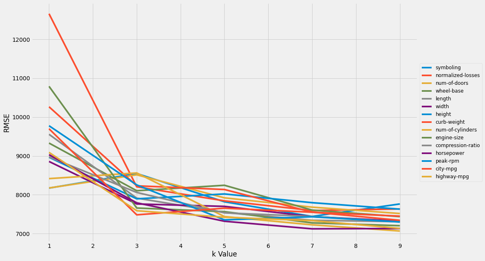
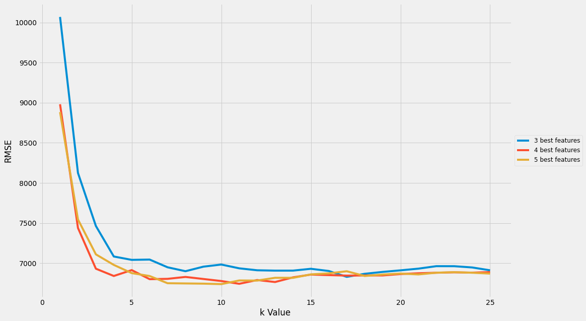

# Laporan Proyek Machine Learning - Samuel Partogi Pakpahan

## Domain Proyek
Pada proyek ini saya menggunakan domain Ekonomi dan bisnis. Seperti yang kita ketahui organisasi bisnis seperti real estate, perusahaan mobil, dan bisnis penjualan daring perlu terus-menerus menyesuaikan harga mereka untuk memaksimalkan keuntungan. Perusahaan harus bisa meningkatkan atau mempertahankan pendapatan dan profit meski menghadapi situasi yang sulit. Situasi sulit ini bisa disebabkan oleh berbagai faktor, antara lain perubahan musim, pergeseran permintaan pelanggan, dan terjadinya kejadian khusus seperti pandemi.

Model predictive analytics dapat dilatih untuk memprediksi harga optimal berdasarkan data atau catatan historis penjualan. Perusahaan dapat menggunakan prediksi ini sebagai masukan untuk menentukan berbagai keputusan bisnis, misalnya strategi penetapan harga.

Merujuk pada penelitian [berikut](https://papers.ssrn.com/sol3/papers.cfm?abstract_id=3702236), India memiliki salah satu pasar mobil terbesar di seluruh dunia setiap hari banyak pembeli biasanya menjual mobil mereka setelah digunakan pembeli lain (mobil bekas). Banyak juga platform seperti cars24.com, cardekho.com dan OLX.com sebagai media bagi pembeli untuk menjual mobil bekas mereka, tetapi berapa harga mobil baru yang seharusnya? Ini adalah pertanyaan terberat yang pernah ada. Algoritma Machine Learning dapat memberikan solusi untuk masalah ini. Menggunakan riwayat data penjualan mobil, kita dapat memprediksi harga mobil yang wajar.

## Business Understanding
Seiring dengan tingginya aktivitas dan bisnis, mobil sudah menjadi kebutuhan pokok. Disisi lain, harga mobil baru semakin tinggi dengan berbagai *feature* yang disematkan pada produk baru. Untuk memenuhi kesenjangan tersebut, masyarakat mencari alternatif untuk membeli mobil bekas yang kondisi masih baik dan layak digunakan. Tingginya minat masyarakat terhadap mobil bekas membuat profit perusahaan mobil semakin menurun, hal ini ditandai dengan banyaknya *showroom* mobil bekas. Tak luput diantara *showroom* sangat kompetitif bersaing agar tetap eksis dalam bisnis mobil bekas. Salah satu masalah yang dihadapi semua perusahaan mobil adalah menentukan harga secara cepat dan akurat sehingga perusahaan bisa mendapatkan profit sebesar mungkin. Berdasarkan penelitian yang saya sebutkan sebelumnya, kondisi saat ini prediksi harga mobil pun masih popular. Berbagai *showroom* maupun perusahaan mobil saling bersaing harga untuk mendapatkan pelanggan.

### Problem Statements
Berdasarkan kondisi diatas, saya akan mengembangkan sebuah sistem prediksi harga mobil untuk menjawab permasalahan berikut.

- Dari serangkaian fitur yang ada, fitur apa yang paling berpengaruh terhadap harga mobil?
- Berapa harga pasar mobil dengan karakteristik atau fitur tertentu?  

### Goals
Untuk  menjawab pertanyaan tersebut, saya membuat predictive modelling dengan tujuan atau goals sebagai berikut:

- Menentukan fitur mana yang terbaik (berkorelasi) untuk digunakan memprediksi harga mobil.
- Membuat model machine learning yang dapat memprediksi harga mobil seakurat mungkin berdasarkan fitur-fitur terbaik yang ada.

### Solution statements
Pada proyek ini saya menggunakan algoritma K-Nearest Neighbor (KNN). KNN adalah algoritma yang relatif sederhana dibandingkan dengan algoritma lain, karena algoritma KNN menggunakan ‘kesamaan fitur’ untuk memprediksi nilai dari setiap data yang baru. Dengan kata lain, setiap data baru diberi nilai berdasarkan seberapa mirip titik tersebut dalam set pelatihan.

KNN bekerja dengan membandingkan jarak satu sampel ke sampel pelatihan lain dengan memilih sejumlah k-tetangga terdekat. Oleh sebab itu, mengapa algoritma ini dinamakan K-nearest neighbor (sejumlah k tetangga terdekat).

Meskipun algoritma KNN mudah dipahami dan digunakan, ia memiliki kekurangan jika dihadapkan pada jumlah fitur atau dimensi yang besar. Permasalahan ini sering disebut sebagai *curse of dimensionality* (kutukan dimensi). Pada dasarnya, permasalahan ini muncul ketika jumlah sampel meningkat secara eksponensial seiring dengan jumlah dimensi (fitur) pada data. Jadi, jika menggunakan model KNN, pastikan data yang digunakan memiliki fitur yang relatif sedikit.

## Data Understanding
Dataset yang saya gunakan adalah [Automobile Data Set](https://archive.ics.uci.edu/ml/datasets/automobile). Dataset ini terdiri dari tiga jenis entitas: 
1. Spesifikasi mobil dalam hal berbagai karakteristik, 
2. Peringkat risiko asuransi yang ditetapkan, 
3. Kerugian yang dinormalisasi dalam penggunaan dibandingkan dengan mobil lain.  

Variabel-variabel pada Automobile Data Set adalah sebagai berikut:
- symboling : sombolisasi peringkat sejauh mana mobil berisiko. Nilai +3 menunjukkan bahwa mobil itu berisiko, -3 bahwa itu mungkin cukup aman.
- normalized-losses : Perbandingan kerugian pemakaian dengan mobil lain.
- make : nama perusahaan pembuat mobil
- fuel-type : jenis bahan bakar.
- num-of-doors : jumlah pintu
- body-style : jenis body mobil
- drive-wheels : jenis sistem penggerak ban mobil
- engine-location : lokasi mesin
- wheel-base : dimensi jarak sumbu roda
- length : panjang mobil
- width : lebar mobil
- height : tinggi mobil
- curb-weight : massa total mobil
- engine-type : jenis mesin
- num-of-cylinders : jumlah silinder mobil
- engine-size : ukuran mesin
- fuel-system : sistem bahan bakar
- bore : diameter silinder atau isi liner blok mesin
- stroke : jarak piston yang bergerak maju-mundur dalam blok mesin
- compression-ratio : nilai yang mewakili rasio volume ruang pembakaran dari kapasitas terbesar ke kapasitas terkecil.
-  horsepower : sebagai satuan daya yang setara dengan tenaga kuda
-  price: harga mobil

## Data Preparation
Sebelum digunakan, Dataset melewati beberapa proses seperti berikut:
1. Inisialisasi variabel (kolom) secara manual, karena dataset asli tidak disertakan.
2. Mengubah kolom bertipe data `objek` menjadi `numeric`, hal ini dilakukan karena ada beberapa kolom yang bernilai numerik menggunakan tipe data `object` sehingga nilai dari kolom tidak dapat di proses. Kemudian ada beberapa kolom yang penulisan nilainya diubah ke dalam angka (numerik).
4. Menggunakan metode `df.replace()` untuk mmengisi nilai yang hilang, lalu melakukan teknik drop terhadap data yang hilang, menggantinya dengan mean. Hal ini dilakukan agar data valid dan dapat digunakan.
6. Melakukan teknik normalisasi pada kolom numerik sehingga semua nilai hanya bernilai dari 0 hingga 1, kecuali kolom `price`

## Modeling
### Model Univariate dan Multivariate
Model Univariate awalnya digunakan untuk menentukan fitur terbaik untuk pemodelan. Hal ini dilakukan dengan memvariasikan hyperparameter nilai k (n_neighbors) pada fungsi KNeighborsRegressor.

Setelah fitur terbaik di dapatkan, selanjutnya dilakukan pemodelan multivariate menggunakan 3, 4, dan 5 fitur terbaik, dengan parameter nilai k bervariasi dari 1-25.

Dari perbandingan grafik ini, dapat disimpulkan bahwa:
1. **Model Predictive harus dilakukan menggunakan 4 atau 5 fitur terbaik** (5 hal yang perlu diperhatikan dalam memprediksi harga pasar mobil, yaitu ['engine-size', 'width', 'horsepower', 'highway-mpg', 'curb-weight'])
2. **Nilai k yang <= 3** harus digunakan untuk meminimalkan nilai RMSE.

## Evaluation
Metrik yang saya gunakan pada prediksi ini adalah RMSE atau Root Mean Squared Error, yaitu cara standar untuk mengukur kesalahan suatu model dalam memprediksi data kuantitatif yang menghitung selisih rata-rata nilai sebenarnya dengan nilai prediksi. MSE didefinisikan dalam persamaan berikut

*Keterangan:

n = jumlah dataset

yi = nilai sebenarnya

ŷ = nilai prediksi*

Bagian ini menjelaskan mengenai metrik evaluasi yang digunakan untuk mengukur kinerja model. Sebagai contoh, Anda memiih kasus klasifikasi dan menggunakan metrik **akurasi, precision, recall, dan F1 score**. Jelaskan mengenai beberapa hal berikut:
- Penjelasan mengenai metrik yang digunakan dan bagaimana formulanya
- Kelebihan dan kekurangan metrik
- Bagaimana cara menerapkannya ke dalam kode.

Ingatlah, metrik evaluasi yang digunakan harus sesuai dengan konteks data, problem statement, dan solusi yang diinginkan.

**---Ini adalah bagian akhir laporan---**
